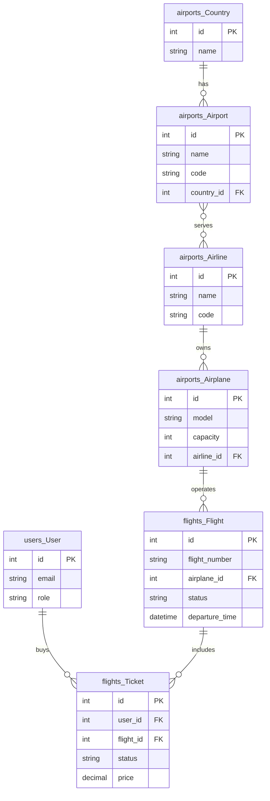

# Airport API Project

Схема відображає зв'язки між моделями додатків `users`, `airports` та `flights`.

```mermaid
erDiagram
    %% Додаток users
    users_User ||--o{ flights_Ticket : buys

    %% Додаток airports
    airports_Country ||--o{ airports_Airport : has
    airports_Airport }o--o{ airports_Airline : serves
    airports_Airline ||--o{ airports_Airplane : owns

    %% Додаток flights
    airports_Airplane ||--o{ flights_Flight : operates
    flights_Flight ||--o{ flights_Ticket : includes

    users_User {
        int id PK
        string email
        string role
    }
    airports_Country {
        int id PK
        string name
    }
    airports_Airport {
        int id PK
        string name
        string code
        int country_id FK
    }
    airports_Airline {
        int id PK
        string name
        string code
    }
    airports_Airplane {
        int id PK
        string model
        int capacity
        int airline_id FK
    }
    flights_Flight {
        int id PK
        string flight_number
        int airplane_id FK
        string status
        datetime departure_time
    }
    flights_Ticket {
        int id PK
        int user_id FK
        int flight_id FK
        string status
        decimal price
    }
```