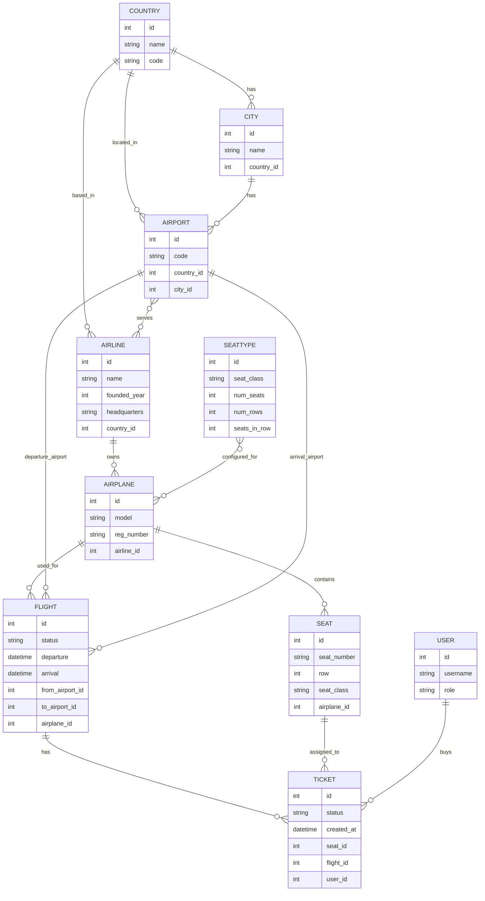

# Airport Project - Models Diagram

## Notes

- `Airline.airport` is `ManyToManyField`, so the diagram shows `AIRPORT }o--o{ AIRLINE`.
- `Airplane.seat_type` is `ManyToManyField`, so `AIRPLANE` does not have `seat_type_id`.
- `Ticket` connects `USER`, `FLIGHT`, and `SEAT`; this is where a user's seat assignment should live.