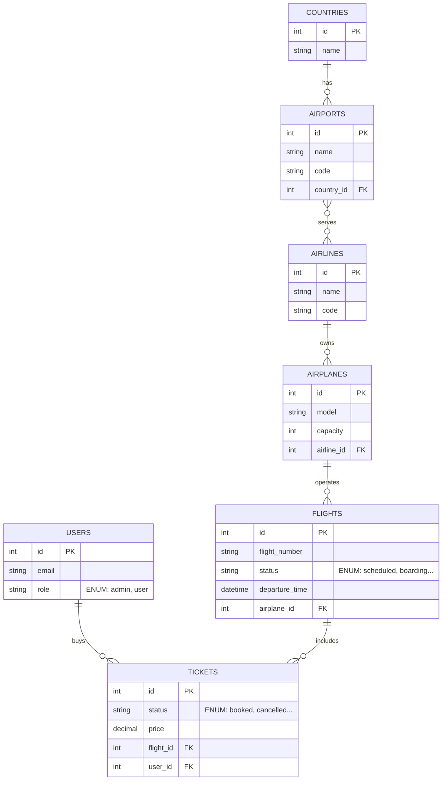

# Airport API Project

```mermaid
erDiagram
  USERS ||--o{ TICKETS : buys
  COUNTRIES ||--o{ AIRPORTS : has
  AIRPORTS }o--o{ AIRLINES : serves
  AIRLINES ||--o{ AIRPLANES : owns
  AIRPLANES ||--o{ FLIGHTS : operates
  FLIGHTS ||--o{ TICKETS : includes

  USERS {
    int id PK
    string email
    string role "ENUM: admin, user"
  }
  COUNTRIES {
    int id PK
    string name
  }
  AIRPORTS {
    int id PK
    string name
    string code
    int country_id FK
  }
  AIRLINES {
    int id PK
    string name
    string code
  }
  AIRPLANES {
    int id PK
    string model
    int capacity
    int airline_id FK
  }
  FLIGHTS {
    int id PK
    string flight_number
    string status "ENUM: scheduled, boarding..."
    datetime departure_time
    int airplane_id FK
  }
  TICKETS {
    int id PK
    string status "ENUM: booked, cancelled..."
    decimal price
    int flight_id FK
    int user_id FK
  }
```
